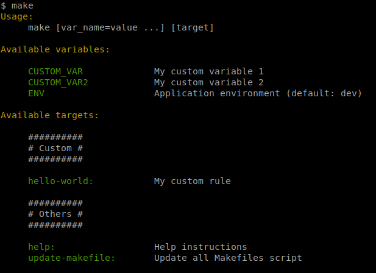
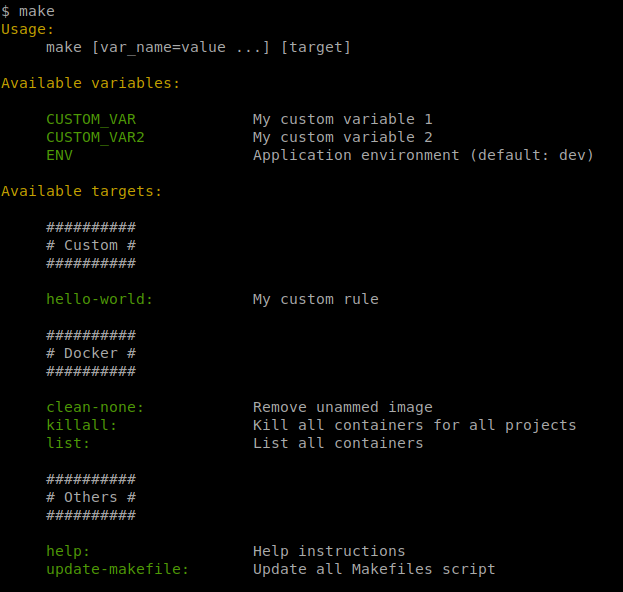

# Auto Makefile

Create a make file with help command based on documentation.
 - Manage rule description
 - Manage custom variable description
 - Add pre-create rule for docker or other project type

## Usage:

Minimal make file example:

```makefile
# configuration #

# external resource #
export MAKEFILE_URL=https://raw.githubusercontent.com/Smeagolworms4/auto-makefile/master
export IMPORT_MK=root.mk

# import #
$(shell [ ! -f .makefiles/index.mk ] && mkdir -p .makefiles && curl -L --silent -f $(MAKEFILE_URL)/$(IMPORT_MK) -o .makefiles/index.mk) 
include .makefiles/index.mk

##########
# Custom #
##########

## My custom rule
hello-world:
	echo Hello world
```

Return this render:
 


### Docker makefile

If you use docker rule make file you must change

```makefile
export IMPORT_MK=docker.mk
```

Return this render:



## Configuration:

### Change base url:

```makefile
export MAKEFILE_URL=http://my_cusom_base_url.com/directory
```

### Overrider rules:

```makefile
# configuration #

export RULE_CMD_UPDATE_MAKEFILE=echo "custom rule" # For command make update-makefile
export RULE_CMD_LIST=echo "custom rule"            # For command make list
export RULE_CMD_KILLALL=echo "custom rule"         # For command make killall
export RULE_CMD_CLEANNONE=echo "custom rule"       # For command make clean-node

[...]
```

### Add require on rules:
```makefile
# configuration #

export RULE_DEP_HELP=rule1 rule2            # For command make help
export RULE_DEP_UPDATE_MAKEFILE=rule1 rule2 # For command make update-makefile
export RULE_DEP_LIST=rule1 rule2            # For command make list
export RULE_DEP_KILLALL=rule1 rule2         # For command make killall
export RULE_DEP_CLEANNONE=rule1 rule2       # For command make clean-node

[...]
```


